<div align="center">
  <div>
    <a href="https://strandsagents.com">
      
    </a>
  </div>

  <h1>
    Strands Coder
  </h1>

  <h2>
    Autonomous GitHub Agent for Strands Agents
  </h2>

  <div align="center">
    <a href="https://pypi.org/project/strands-coder/"></a>
    <a href="https://github.com/cagataycali/strands-coder"></a>
    <a href="https://github.com/cagataycali/strands-coder/blob/main/LICENSE"></a>
    <a href="https://aws.amazon.com/bedrock/"></a>
    <a href="https://cloud.langfuse.com"></a>
  </div>
  
  <p>
    <a href="https://strandsagents.com/">Strands Docs</a>
    ◆ <a href="https://aws.amazon.com/bedrock/">AWS Bedrock</a>
    ◆ <a href="https://cloud.langfuse.com">Langfuse</a>
    ◆ <a href="https://github.com/strands-agents/sdk-python">Strands SDK</a>
    ◆ <a href="https://dev.strands.my">Dashboard</a>
  </p>
</div>

An autonomous GitHub agent that codes, reviews, tracks, schedules, and evolves—all on its own. Built with [Strands Agents SDK](https://github.com/strands-agents/sdk-python), it doesn't just respond to events—it proactively identifies work, creates issues, reviews PRs, tracks progress in GitHub Projects, and learns from every interaction.

## How It Works


## Architecture


## 🌐 Web Dashboard

**Live Demo:** [dev.strands.my](https://dev.strands.my)

A zero-install PWA dashboard for managing your Strands Coder agent:

| Tab | Features |
|-----|----------|
| 📊 **Dashboard** | Project stats, GitHub Project board integration |
| 📋 **Issues** | Browse, filter, create issues with full thread view |
| ⚡ **Actions** | Live log streaming, issue-linked workflow runs |
| 📈 **Traces** | Langfuse integration with conversation playback |
| 🤖 **Agent** | Configure model, tools, MCP servers, knowledge base |
| 📅 **Schedule** | Cron job management with enable/disable |
| ⚙️ **Settings** | GitHub & Langfuse config, encrypted share links |

<details>
<summary><b>Dashboard Setup</b></summary>

1. **Open** [dev.strands.my](https://dev.strands.my) on any device
2. **Configure** GitHub token and repository in Settings
3. **Optionally** add Langfuse credentials for trace viewing
4. **Share** encrypted config links with your team

The dashboard connects directly to GitHub and Langfuse APIs from your browser—no backend required.

**Self-Host:** Deploy `docs/index.html` to any static hosting (GitHub Pages, Cloudflare, etc.)

</details>

---

## Quick Start

```python
from strands import Agent
from strands_coder import use_github, projects, scheduler, store_in_kb

# Create agent with GitHub tools
agent = Agent(
    tools=[use_github, projects, scheduler, store_in_kb],
    system_prompt="You are an autonomous GitHub agent."
)

# Review open PRs
agent("List all open pull requests and summarize their status")

# Add issue to project board
agent("Add issue #42 to the project and set status to 'In Progress'")

# Schedule recurring task
agent("Schedule a daily code review job at 9 AM UTC")
```

## Installation

```bash
pip install strands-coder
```

Or from source:

```bash
git clone https://github.com/cagataycali/strands-coder
cd strands-coder
pip install -e .
```

<details>
<summary><b>🔐 GitHub Actions Setup (Recommended)</b></summary>

### 1. Configure Secrets

```yaml
# Repository Settings → Secrets and variables → Actions → Secrets
AWS_ROLE_ARN: arn:aws:iam::YOUR_ACCOUNT:role/StrandsCoder
PAT_TOKEN: ghp_xxxxxxxxxxxxx
AUTHORIZED_USERS: octocat,yourname,github-actions[bot]

# Optional - Observability
LANGFUSE_BASE_URL: https://cloud.langfuse.com
LANGFUSE_PUBLIC_KEY: pk-lf-xxx
LANGFUSE_SECRET_KEY: sk-lf-xxx
```

### 2. Configure Variables

```yaml
# Repository Settings → Secrets and variables → Actions → Variables
SYSTEM_PROMPT: "Your custom instructions here"
STRANDS_CODER_PROJECT_ID: PVT_kwDOAbcDefg
STRANDS_KNOWLEDGE_BASE_ID: YOUR_KB_ID
STRANDS_MODEL_ID: global.anthropic.claude-opus-4-5-20251101-v1:0
STRANDS_TOOLS: strands_tools:shell,retrieve;strands_coder:use_github,projects,scheduler
```

### 3. Deploy Workflows

```bash
git add .github/workflows/agent.yml .github/workflows/control.yml
git commit -m "feat: add strands-coder agent"
git push origin main
```

</details>

## Event Flow


## Tools Reference

### use_github

Universal GitHub GraphQL API interface for queries and mutations.

| Action | Parameters | Description | Example |
|--------|------------|-------------|---------|
| `query` | `query`, `variables` | Execute GraphQL query | `"Get repository info"` |
| `mutation` | `query`, `variables` | Execute GraphQL mutation | `"Create issue"` |

**Natural Language Examples:**

```python
# Query repository
agent("List all open issues in this repository")

# Create PR comment
agent("Add a review comment to PR #45 suggesting code improvements")

# Close issue
agent("Close issue #42 with a summary comment")
```

<details>
<summary><b>GraphQL Query Examples</b></summary>

```python
# Get repository info
agent.tool.use_github(
    query_type="query",
    query="""
    query($owner: String!, $name: String!) {
      repository(owner: $owner, name: $name) {
        name
        description
        stargazerCount
        issues(states: OPEN) { totalCount }
      }
    }
    """,
    variables={"owner": "strands-agents", "name": "sdk-python"},
    label="Get repository info"
)
```

</details>

---

### projects

GitHub Projects V2 management for cross-repository work tracking.

| Action | Parameters | Description | Example |
|--------|------------|-------------|---------|
| `list_projects` | `owner` | List all projects | `"List my projects"` |
| `get_project` | `project_id` | Get project details | `"Show project status"` |
| `add_issue` | `repository`, `issue_number` | Add issue to project | `"Track issue #42"` |
| `add_pr` | `repository`, `pr_number` | Add PR to project | `"Track PR #45"` |
| `update_item` | `item_id`, `field_name`, `field_value` | Update item field | `"Set status to Done"` |
| `get_progress` | - | Get progress summary | `"Show project progress"` |

**Natural Language Examples:**

```python
# Add issue to project
agent("Add issue #42 from strands-agents/sdk-python to my project")

# Update status
agent("Mark the item for issue #42 as 'In Progress'")

# Get summary
agent("Show me the project progress with counts by status")
```

---

### scheduler

Cron-based and one-time job scheduling via GitHub Actions variables.

| Action | Parameters | Description | Example |
|--------|------------|-------------|---------|
| `list` | - | List all scheduled jobs | `"List scheduled jobs"` |
| `add` | `job_id`, `cron`/`run_at`, `prompt` | Add new job | `"Schedule daily review"` |
| `remove` | `job_id` | Remove job | `"Remove daily_review job"` |
| `enable` | `job_id` | Enable disabled job | `"Enable weekly_report"` |
| `disable` | `job_id` | Disable job | `"Pause daily_review"` |
| `check` | - | Check jobs due now | `"What jobs should run?"` |

**Natural Language Examples:**

```python
# Schedule recurring job
agent("Schedule a job called 'daily_review' to run at 9 AM UTC daily with prompt 'Review open PRs'")

# One-time scheduled job
agent("Schedule deployment for January 20th at 2 PM UTC, auto-remove after execution")

# Disable temporarily
agent("Disable the daily_review job")
```

<details>
<summary><b>AGENT_SCHEDULES Format</b></summary>

```json
{
  "jobs": {
    "daily_review": {
      "cron": "0 9 * * *",
      "enabled": true,
      "prompt": "Review open PRs and provide feedback",
      "system_prompt": "You are a code reviewer",
      "tools": "strands_tools:shell;strands_coder:use_github",
      "model": "global.anthropic.claude-sonnet-4-5-20251101-v1:0"
    },
    "friday_deploy": {
      "run_at": "2026-01-17T15:00:00Z",
      "prompt": "Deploy release to production",
      "once": true
    }
  },
  "timezone": "UTC"
}
```

**Cron Expression Reference:**

```
┌───────────── minute (0-59)
│ ┌─────────── hour (0-23)
│ │ ┌───────── day of month (1-31)
│ │ │ ┌─────── month (1-12)
│ │ │ │ ┌───── day of week (0-6, Sunday=0)
│ │ │ │ │
* * * * *

0 * * * *     # Every hour
0 9 * * *     # Daily at 9:00 AM
0 9 * * 1-5   # Weekdays at 9:00 AM
0 */4 * * *   # Every 4 hours
```

</details>

---

### create_subagent

Spawn parallel sub-agents via GitHub Actions workflow dispatch.

| Action | Parameters | Description | Example |
|--------|------------|-------------|---------|
| `create` | `repository`, `workflow_id`, `prompt`, `model`, `tools` | Spawn sub-agent | `"Create review agent"` |
| `status` | `repository`, `run_id` | Check run status | `"Check agent status"` |
| `list` | `repository`, `workflow_id` | List recent runs | `"List sub-agent runs"` |

**Natural Language Examples:**

```python
# Spawn specialized sub-agent
agent("Create a sub-agent to review PR #42 for security issues using Claude Opus")

# Check status
agent("Check the status of sub-agent run 12345678")
```

<details>
<summary><b>Sub-Agent Configuration</b></summary>

```python
agent.tool.create_subagent(
    repository="owner/repo",
    workflow_id="agent.yml",
    prompt="Review PR #42 for security vulnerabilities",
    model="global.anthropic.claude-opus-4-5-20251101-v1:0",
    max_tokens=60000,
    tools="strands_tools:shell,retrieve",
    system_prompt="You are a security expert focused on code review"
)
```

</details>

---

### store_in_kb

Async knowledge base storage for persistent memory across sessions.

| Action | Parameters | Description | Example |
|--------|------------|-------------|---------|
| `store` | `content`, `title` | Store content | `"Remember this solution"` |

**Natural Language Examples:**

```python
# Store learning
agent("Store in knowledge base: 'Memory leaks fixed by implementing proper cleanup in __del__'")
```

---

### system_prompt

Self-modification tool for runtime prompt updates.

| Action | Parameters | Description | Example |
|--------|------------|-------------|---------|
| `view` | - | View current prompt | `"Show system prompt"` |
| `update` | `prompt`, `repository` | Replace prompt | `"Update my instructions"` |
| `add_context` | `context`, `repository` | Append context | `"Remember this pattern"` |
| `reset` | - | Reset to default | `"Reset system prompt"` |

**Natural Language Examples:**

```python
# Add learning
agent("Add to system prompt: 'Users prefer detailed code explanations with examples'")

# Sync to GitHub
agent("Update system prompt and sync to repository variable")
```

---

## Context Injection

The agent sees full conversation context, not just the latest message:

```mermaid
flowchart LR
    subgraph Event["📥 GitHub Event"]
        E1[Issue Created]
        E2[Comment Added]
        E3[PR Reviewed]
    end

    subgraph Context["📋 Context Builder"]
        direction TB
        C1[Raw GITHUB_CONTEXT]
        C2[GraphQL Enrichment]
        C3[Comments Thread]
        C4[Linked Items]
        C5[Project Status]
    end

    subgraph Prompt["🧠 System Prompt"]
        P1[Base Instructions]
        P2[Event Context]
        P3[Project Context]
        P4[Self-Awareness]
    end

    Event --> Context
    Context --> Prompt
    Prompt --> Agent[Agent]

    classDef eventStyle fill:#2ea44f,stroke:#1b7735,color:#fff
    classDef contextStyle fill:#8250df,stroke:#5a32a3,color:#fff
    classDef promptStyle fill:#0969da,stroke:#044289,color:#fff

    class E1,E2,E3 eventStyle
    class C1,C2,C3,C4,C5 contextStyle
    class P1,P2,P3,P4 promptStyle
```



<details>
<summary><b>Example Injected Context</b></summary>

```markdown
## 📋 RAW GITHUB_CONTEXT
**Event Type:** `issue_comment`
**Repository:** `owner/repo`
**Action:** `created`
**Actor:** `alice`

## 🎫 ISSUE CONTEXT
**Issue:** #42: Memory leak in agent loop
**State:** open | **Author:** @alice | **Created:** 2026-01-09

### Original Issue Body
The agent seems to leak memory when running for extended periods...

### 💬 Comments (5 total)
**Comment #1** by @bob at 2026-01-09 14:32:
I've seen this too. Here's a stack trace...

**Comment #2** by @strands-agent at 2026-01-09 15:15:
I've analyzed the code and found the issue in the event loop...

### 🔗 Linked Items
- PR #45: Fix memory leak (OPEN)

## 📊 PROJECT CONTEXT
**Project:** Strands-Coder (#1)
- Todo: 5 | In Progress: 3 | Done: 42
```

</details>

## Two-Workflow Architecture


| Workflow | Trigger | Purpose |
|----------|---------|---------|
| `agent.yml` | Events, Schedule, Dispatch | Main agent execution |
| `control.yml` | Hourly | Check `AGENT_SCHEDULES` and dispatch jobs |

## Observability


**Features:**
- 🏷️ **Trace Linking**: All traces tagged with `issue:{number}` for filtering
- 💬 **Conversation View**: Timeline of agent reasoning
- 💰 **Cost Tracking**: Token usage and costs per trace
- 🔄 **Session Persistence**: S3-backed conversation history

<details>
<summary><b>Dashboard Features</b></summary>

The web dashboard at [dev.strands.my](https://dev.strands.my) (also available as `docs/index.html`) provides:

| Tab | Description |
|-----|-------------|
| 📋 **Issues** | Browse, search, create issues |
| 📊 **Dashboard** | Project stats and board overview |
| ⚡ **Actions** | Workflow runs with live logs |
| 📈 **Traces** | Langfuse traces with playback |
| 📅 **Schedule** | Job scheduler management |
| 🤖 **Agent** | Model, tools, prompt configuration |
| ⚙️ **Settings** | GitHub & Langfuse credentials |

</details>

## Project Structure

```
strands-coder/
├── strands_coder/
│   ├── __init__.py              # Package exports
│   ├── agent_runner.py          # Main entry point
│   ├── context.py               # Context builder & prompt assembly
│   └── tools/
│       ├── __init__.py          # Tool exports
│       ├── use_github.py        # GitHub GraphQL interface
│       ├── github_tools.py      # GitHub REST helpers
│       ├── projects.py          # GitHub Projects V2
│       ├── scheduler.py         # Job scheduling
│       ├── create_subagent.py   # Parallel agent spawning
│       ├── store_in_kb.py       # Knowledge base storage
│       └── system_prompt.py     # Self-modification
├── .github/
│   └── workflows/
│       ├── agent.yml            # Main agent workflow
│       └── control.yml          # Scheduler control loop
├── docs/
│   └── index.html               # Web dashboard
├── action.yml                   # GitHub Action definition
└── pyproject.toml               # Package configuration
```

## Model Configuration

| Model | Use Case | Max Tokens |
|-------|----------|------------|
| `global.anthropic.claude-opus-4-5-20251101-v1:0` | Complex reasoning | 60,000 |
| `global.anthropic.claude-sonnet-4-5-20251101-v1:0` | Balanced performance | 60,000 |
| `us.anthropic.claude-sonnet-4-20250514-v1:0` | Fast & efficient | 32,768 |

<details>
<summary><b>MCP Server Configuration</b></summary>

```yaml
MCP_SERVERS: |
  {
    "mcpServers": {
      "strands-docs": {
        "command": "uvx",
        "args": ["strands-agents-mcp-server"],
        "disabled": false,
        "disabledTools": []
      },
      "custom-server": {
        "url": "http://localhost:8000/mcp"
      }
    }
  }
```

</details>

## Example: Complete Workflow

```python
#!/usr/bin/env python3
"""Autonomous GitHub agent example."""
from strands import Agent
from strands_coder import (
    use_github,
    projects,
    scheduler,
    create_subagent,
    store_in_kb,
    system_prompt,
)

# Create agent with full toolset
agent = Agent(
    tools=[use_github, projects, scheduler, create_subagent, store_in_kb, system_prompt],
    system_prompt="""You are an autonomous GitHub agent.
    - Review PRs with detailed feedback
    - Track work in GitHub Projects
    - Learn from every interaction
    - Schedule recurring maintenance tasks
    """
)

# Interactive mode
while True:
    user_input = input("\n🤖 > ")
    if user_input.lower() in ["exit", "quit"]:
        break
    agent(user_input)
```

## CLI Usage

```bash
# Run with prompt
strands-coder "Review all open PRs"

# Via environment variable
STRANDS_PROMPT="Create tracking issues for stale PRs" strands-coder

# With custom configuration
STRANDS_MODEL_ID="global.anthropic.claude-opus-4-5-20251101-v1:0" \
STRANDS_TOOLS="strands_coder:use_github,projects" \
strands-coder "Analyze repository health"
```

## Contributing

We welcome contributions! The agent will review your PR automatically. 🧬

```bash
# 1. Fork & clone
git clone https://github.com/YOUR_USERNAME/strands-coder.git

# 2. Install dev dependencies
pip install -e ".[dev]"

# 3. Run tests
hatch run test

# 4. Format & lint
hatch run prepare

# 5. Submit PR
git push origin feat/my-feature
```

## License

Apache-2.0 - see [LICENSE](LICENSE) file.

## Links

<div align="center">
  <a href="https://github.com/cagataycali/strands-coder">GitHub</a>
  ◆ <a href="https://pypi.org/project/strands-coder/">PyPI</a>
  ◆ <a href="https://dev.strands.my">Dashboard</a>
  ◆ <a href="https://strandsagents.com/">Strands Docs</a>
  ◆ <a href="https://aws.amazon.com/bedrock/">AWS Bedrock</a>
  ◆ <a href="https://cloud.langfuse.com">Langfuse</a>
</div>
